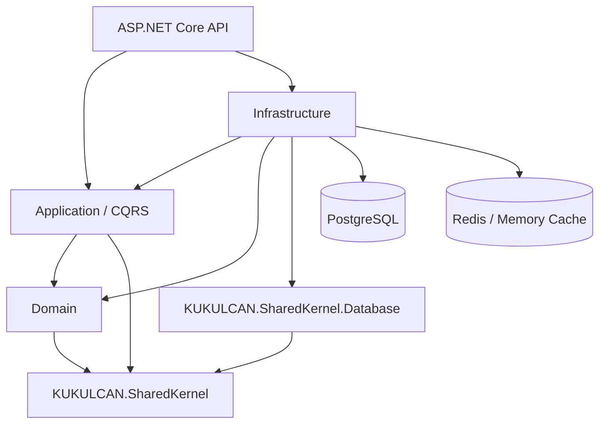

# Architecture

> **KUKULCAN.SharedKernel.i18n**  
> **Architecture Handbook**  
> Status: **Stable**

---

# Table of Contents

1. [Introduction](#1-introduction)
2. [Architectural Vision](#2-architectural-vision)
3. [High-Level Architecture](#3-high-level-architecture)
4. [Project Boundaries](#4-project-boundaries)
5. [Dependency Model](#5-dependency-model)
6. [Domain Model](#6-domain-model)
7. [Application Model](#7-application-model)
8. [Infrastructure Model](#8-infrastructure-model)
9. [API Boundary](#9-api-boundary)
10. [Cross-Cutting Concerns](#10-cross-cutting-concerns)
11. [Key Design Decisions](#11-key-design-decisions)
12. [Testing Strategy](#12-testing-strategy)
13. [Evolution Rules](#13-evolution-rules)

---

# 1. Introduction

`KUKULCAN.SharedKernel.i18n` is the internationalization service for the KUKULCAN platform. Its responsibility is to centralize translation text and locale-related formatting metadata so that consuming applications do not embed language-specific resources in their own bounded contexts.

The service provides three closely related capabilities:

- Translation lookup and administration.
- Language and locale configuration.
- Currency-format configuration.

The architecture follows Domain-Driven Design and Clean Architecture. The domain owns business rules, the application layer coordinates use cases, infrastructure implements persistence and technical services, and the API exposes the application boundary through HTTP.

---

# 2. Architectural Vision

The service is intentionally designed as a platform capability rather than as a UI-specific resource server. Translation codes are stable identifiers shared by consuming modules, while language, locale and currency configuration are managed centrally.

The principal architectural goals are:

| Goal | Description |
|---|---|
| Separation | Domain rules must not depend on HTTP or EF Core. |
| Consistency | Translation and language invariants are enforced centrally. |
| Fallback | Language resolution supports BCP-47 fallback before the global default. |
| Performance | Translation lookup is treated as a hot path and cached. |
| Testability | Use cases are isolated behind MediatR and domain contracts. |
| Evolvability | Persistence and API details remain replaceable boundaries. |

---

# 3. High-Level Architecture



The important dependency rule is that infrastructure implements contracts owned by the inner layers. The API composes the application and infrastructure services but does not contain business rules.

---

# 4. Project Boundaries

## Domain

`KUKULCAN.SharedKernel.i18n.Domain` contains entities, value objects, domain services, repository contracts, identifiers, DTOs used by the module boundary and domain errors.

The principal domain concepts are:

- `Language`
- `Translation`
- `LocaleConfiguration`
- `CurrencyFormat`
- `LanguageCode`
- `TranslationCode`

## Application

`KUKULCAN.SharedKernel.i18n.Application` contains commands, queries, handlers, validators, MediatR behaviors, application contracts and registration.

Features are organized by business capability:

- `Translations`
- `Languages`
- `Locales`
- `Currencies`

## Infrastructure

`KUKULCAN.SharedKernel.i18n.Infrastructure` implements persistence and technical services. It depends on `KUKULCAN.SharedKernel.Database` for shared EF Core infrastructure and uses PostgreSQL as the module database provider.

Redis and in-process memory caching are infrastructure concerns and are not exposed as domain implementation details.

## API

`KUKULCAN.SharedKernel.i18n.API` is the HTTP adapter. Controllers translate HTTP requests into MediatR commands and queries and convert application results into HTTP responses.

---

# 5. Dependency Model

The intended dependency direction is:

```text
API
 ├── Application
 └── Infrastructure
       ├── Application
       ├── Domain
       └── SharedKernel.Database

Application
 └── Domain

Domain
 └── SharedKernel
```

Rules:

1. Domain must not reference the API.
2. Domain must not reference EF Core persistence implementations.
3. Application must not reference controllers.
4. Infrastructure implements application/domain contracts rather than moving business rules into persistence.
5. API must remain thin.
6. `KUKULCAN.SharedKernel.Database` remains a persistence foundation, not a second domain layer.

The current Domain project contains Microsoft.Extensions cache/logging abstractions for module services. Those dependencies are technical abstractions and should remain isolated from domain entities and value objects.

---

# 6. Domain Model

`Language` represents a supported language and its BCP-47 code. It also carries active/default state. The default language is a global fallback and cannot be deactivated while it is the default.

`Translation` represents one translation code in one language. Translation codes follow the platform convention `{MODULE}{NNNN}`, for example `CRM0001`.

`LocaleConfiguration` represents language-specific date, time and numeric formatting metadata.

`CurrencyFormat` represents the formatting rules for a currency within a language, including symbol position, spacing, separators, decimal places and negative-number pattern.

Value objects keep identifiers strongly typed:

- `LanguageCode` encapsulates language-code validation.
- `TranslationCode` encapsulates module-prefix and numeric-suffix validation.

Domain services separate rules that operate across aggregates, while repository interfaces define persistence contracts without prescribing the persistence technology.

---

# 7. Application Model

The application layer uses MediatR to model use cases as commands and queries.

```text
Feature
├── Command / Query
├── Handler
└── Validator
```

Validation is performed before business execution through FluentValidation and application behaviors. Logging and other pipeline concerns are kept outside individual handlers.

The translation feature contains lookup, module dictionary, pagination, variants, create, update, review and bulk-upsert use cases.

This organization keeps the use-case boundary explicit and prevents controllers from accumulating orchestration logic.

---

# 8. Infrastructure Model

Persistence uses EF Core through `I18nDbContext`. Entity configurations are kept separate from the domain classes.

Repositories implement the domain contracts and are registered through infrastructure composition. Database provider selection is deliberately local to infrastructure; the domain has no PostgreSQL dependency.

Caching follows a two-level strategy:

```text
Request
  |
  v
L1 Memory Cache
  |
  +-- miss --> L2 Redis
                 |
                 +-- miss --> PostgreSQL
```

Redis is optional. When no Redis connection is configured, the service can operate with the memory-only implementation.

---

# 9. API Boundary

The API exposes versioned routes below `/api/v1` and uses policy-based JWT authorization.

Read operations use `i18n.read`; administration operations use `i18n.write`.

Controllers return DTOs or `ProblemDetails` and use the common result-to-HTTP mapping extensions supplied by the API project.

---

# 10. Cross-Cutting Concerns

### Internationalization fallback

The translation lookup path walks the requested BCP-47 language hierarchy, such as `es-MX -> es`, and ultimately uses the configured global default language.

### Caching

Translation lookup is cached for high read throughput. Locale and currency configuration have longer cache lifetimes because they change less frequently.

### Observability

The API uses Serilog and exposes health checks for service liveness/readiness. Persistence and Redis are treated as readiness dependencies.

### Security

JWT Bearer authentication protects both read and write endpoints through named authorization policies. The write policy is intended for administrative roles.

---

# 11. Key Design Decisions

## Stable translation identifiers

Translation codes are module-owned identifiers instead of database-generated identifiers. This makes them suitable for use across independent applications.

## English/default-language protection

The default language is protected from deactivation, and translation management protects default-language records from ordinary deletion. This preserves a complete fallback base.

## CQRS

Reads and writes have different performance and authorization characteristics, so commands and queries are kept separate.

## Infrastructure isolation

PostgreSQL, Redis, EF Core and ASP.NET concerns remain outside the domain model.

## Shared persistence foundation

The module consumes `KUKULCAN.SharedKernel.Database` instead of implementing another generic persistence framework.

---

# 12. Testing Strategy

The solution contains separate test projects for Domain, Application, Infrastructure and API.

Testing should follow the same architectural boundaries:

- Domain tests verify invariants without infrastructure.
- Application tests verify handlers, validators and pipeline behavior.
- Infrastructure tests verify EF Core mappings, repositories and cache behavior.
- API tests verify routing, authorization and HTTP contracts.

---

# 13. Evolution Rules

Changes to translation-code rules, fallback semantics, default-language behavior or public API routes are architectural changes and require documentation updates.

New persistence providers should be introduced in Infrastructure only.

New business capabilities should normally begin as a domain concept and application feature rather than as controller logic.

The documentation is considered part of the architecture contract and should be reviewed whenever the public model changes.
